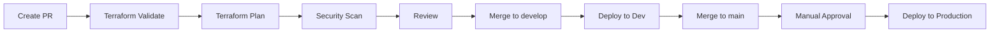

# GitHub Actions CI/CD Pipeline Documentation

## Overview

This repository contains a complete GitHub Actions CI/CD pipeline setup for the ChatOps Teams Integration project. The pipelines are separated into **infrastructure** (Terraform) and **application** deployments, following best practices for Azure deployments.

## Pipeline Architecture

### Infrastructure Pipelines
Infrastructure changes are managed through Terraform and deployed to Azure:
- **PR Validation** → Terraform format, validate, plan, security scan
- **Dev Deployment** → Automated deployment on `develop` branch
- **Production Deployment** → Manual approval + deployment on `main` branch

### Application Pipelines
Application code is built, tested, and deployed to Azure App Services:
- **CI (Pull Request)** → Build, test, security scan, code quality
- **CD to Dev** → Automated deployment on `develop` branch
- **CD to Staging** → Automated deployment on `main` branch
- **CD to Production** → Manual approval + blue-green deployment

## Workflow Files

| Workflow | Purpose | Trigger |
|----------|---------|---------|
| `infra-pr-validation.yml` | Validate infrastructure changes | PR to `main`/`develop` |
| `infra-deploy-dev.yml` | Deploy infrastructure to dev | Push to `develop` |
| `infra-deploy-prod.yml` | Deploy infrastructure to production | Push to `main` |
| `app-ci.yml` | Application CI checks | PR to `main`/`develop` |
| `app-cd-dev.yml` | Deploy app to dev | Push to `develop` |
| `app-cd-staging.yml` | Deploy app to staging | Push to `main` |
| `app-cd-prod.yml` | Deploy app to production | Manual trigger or release |
| `reusable-terraform.yml` | Reusable Terraform workflow | Called by other workflows |
| `reusable-azure-deploy.yml` | Reusable Azure deployment | Called by other workflows |

---

## GitHub Environments Setup

### Required Environments

You need to create the following GitHub Environments in your repository settings:

#### 1. **dev** Environment
- **Protection rules:** None
- **Purpose:** Development environment for testing

#### 2. **staging** Environment
- **Protection rules:** Optional reviewers
- **Purpose:** Pre-production testing

#### 3. **production** Environment
- **Protection rules:**
  - ✅ Required reviewers (2+ recommended)
  - ✅ Wait timer: 5 minutes (optional)
  - ✅ Deployment branches: `main` only
- **Purpose:** Production environment

### How to Create Environments

1. Go to **Settings** → **Environments** in your GitHub repository
2. Click **New environment**
3. Name it (`dev`, `staging`, or `production`)
4. Configure protection rules as specified above
5. Add environment secrets and variables (see below)

---

## Required Secrets Configuration

### Repository Secrets (All Environments)

Configure these secrets at **Settings** → **Secrets and variables** → **Actions** → **Secrets**:

| Secret Name | Description | How to Get |
|------------|-------------|------------|
| `AZURE_CLIENT_ID` | Azure Service Principal Client ID | Azure Portal → Entra ID → App Registrations |
| `AZURE_TENANT_ID` | Azure Tenant ID | Azure Portal → Entra ID → Overview |
| `AZURE_SUBSCRIPTION_ID` | Azure Subscription ID | Azure Portal → Subscriptions |
| `TERRAFORM_BACKEND_RG` | Resource group for Terraform state | Create in Azure |
| `TERRAFORM_BACKEND_SA` | Storage account for Terraform state | Create in Azure |

### Environment-Specific Secrets

Configure these secrets in each environment:

#### Dev Environment
| Secret Name | Description |
|------------|-------------|
| `DEV_APP_SERVICE_NAME` | Name of dev App Service (optional if using tags) |

#### Staging Environment
| Secret Name | Description |
|------------|-------------|
| `STAGING_APP_SERVICE_NAME` | Name of staging App Service (optional if using tags) |

#### Production Environment
| Secret Name | Description |
|------------|-------------|
| `PROD_APP_SERVICE_NAME` | Name of production App Service |
| `PROD_RESOURCE_GROUP` | Resource group name for production |

### Optional Secrets
| Secret Name | Description | Used By |
|------------|-------------|---------|
| `SONAR_TOKEN` | SonarCloud authentication token | Code quality analysis |
| `INFRACOST_API_KEY` | Infracost API key | Cost estimation |
| `CODECOV_TOKEN` | Codecov upload token | Code coverage |

---

## Repository Variables

Configure these variables at **Settings** → **Secrets and variables** → **Actions** → **Variables**:

| Variable Name | Value | Description |
|--------------|-------|-------------|
| `TEAMS_WEBHOOK_URL` | `https://...` | Microsoft Teams webhook for notifications |

---

## Azure Setup Prerequisites

### 1. Create Azure Service Principal with OIDC

```bash
# Create service principal
az ad sp create-for-rbac \
  --name "github-actions-chatops" \
  --role contributor \
  --scopes /subscriptions/{SUBSCRIPTION_ID} \
  --sdk-auth

# Configure OIDC federation
az ad app federated-credential create \
  --id {APP_ID} \
  --parameters '{
    "name": "github-actions",
    "issuer": "https://token.actions.githubusercontent.com",
    "subject": "repo:{GITHUB_ORG}/{REPO_NAME}:ref:refs/heads/main",
    "audiences": ["api://AzureADTokenExchange"]
  }'
```

### 2. Create Terraform Backend Storage

```bash
# Create resource group
az group create \
  --name rg-terraform-state \
  --location eastus

# Create storage account
az storage account create \
  --name stterraformstate{UNIQUE} \
  --resource-group rg-terraform-state \
  --location eastus \
  --sku Standard_LRS

# Create container
az storage container create \
  --name tfstate \
  --account-name stterraformstate{UNIQUE}
```

### 3. Tag Azure Resources

For automatic resource discovery, tag your Azure resources:

```bash
az resource tag \
  --resource-group {RG_NAME} \
  --name {RESOURCE_NAME} \
  --resource-type {RESOURCE_TYPE} \
  --tags \
    environment=dev \
    application=chatops-teams
```

---

## Branch Strategy

### Branching Model

```
main (protected)
  ├── Production deployments
  ├── Staging deployments
  └── Infrastructure production
  
develop (protected)
  ├── Dev deployments
  └── Infrastructure dev
  
feature/* (short-lived)
  └── Pull requests
```

### Branch Protection Rules

#### `main` Branch
- ✅ Require pull request reviews (2 approvers)
- ✅ Require status checks to pass
  - Infrastructure PR Validation
  - Application CI
- ✅ Require branches to be up to date
- ✅ Restrict force pushes
- ✅ Restrict deletions

#### `develop` Branch
- ✅ Require pull request reviews (1 approver)
- ✅ Require status checks to pass
  - Application CI
- ✅ Restrict force pushes

---

## Deployment Flow

### Infrastructure Changes



### Application Changes

```mermaid
graph LR
    A[Create PR] --> B[Build & Test]
    B --> C[Security Scan]
    C --> D[Code Quality]
    D --> E[Review]
    E --> F[Merge to develop]
    F --> G[Deploy to Dev]
    G --> H[Merge to main]
    H --> I[Deploy to Staging]
    I --> J[Manual Approval]
    J --> K[Blue-Green Deploy to Prod]
```



---

## Pipeline Features

### Infrastructure Pipelines

✅ **Terraform Validation**
- Format checking
- Configuration validation
- Plan generation with PR comments

✅ **Security Scanning**
- tfsec for infrastructure security
- SARIF upload to GitHub Security

✅ **Cost Estimation**
- Infracost integration (optional)
- PR comments with cost breakdown

✅ **Post-Deployment Validation**
- Resource health checks
- Key Vault access validation

### Application Pipelines

✅ **Multi-Runtime Support**
- Automatic detection (Node.js or .NET)
- Runtime-specific build and test steps

✅ **Comprehensive Testing**
- Unit tests with coverage
- Integration tests
- E2E tests (Playwright)

✅ **Security Scanning**
- CodeQL analysis
- Dependency scanning (OWASP)
- Secret scanning (TruffleHog)
- Dependabot alerts

✅ **Code Quality**
- SonarCloud integration
- Linting (ESLint/.NET analyzers)
- Code coverage reporting

✅ **Production Deployment**
- Blue-green deployment (zero downtime)
- Automatic health checks
- Automatic rollback on failure
- Deployment notifications

---

## Usage Examples

### Deploying Infrastructure Changes

1. Create feature branch: `git checkout -b infra/add-application-gateway`
2. Make changes in `infrastructure/` directory
3. Commit and push: `git push origin infra/add-application-gateway`
4. Create PR to `develop` → Terraform plan will comment on PR
5. After review, merge to `develop` → Deploys to dev automatically
6. Create PR from `develop` to `main`
7. After approval, merge to `main` → Requires manual approval → Deploys to production

### Deploying Application Changes

1. Create feature branch: `git checkout -b feature/webhook-handler`
2. Make changes in `src/` directory
3. Commit and push: `git push origin feature/webhook-handler`
4. Create PR to `develop` → CI checks run
5. After review, merge to `develop` → Deploys to dev automatically
6. Merge `develop` to `main` → Deploys to staging automatically
7. Trigger production deployment:
   - Go to **Actions** → **Application - CD to Production**
   - Click **Run workflow**
   - Enter release version (e.g., `v1.0.0`)
   - Type `DEPLOY` to confirm
   - Wait for manual approval
   - Blue-green deployment executes

### Manual Production Deployment

```bash
# Via GitHub UI
1. Go to Actions → Application - CD to Production
2. Click "Run workflow"
3. Select branch: main
4. Enter release version: v1.2.3
5. Type "DEPLOY" to confirm
6. Click "Run workflow"
7. Approve in Environments when prompted
```

---

## Monitoring and Observability

### GitHub Actions Logs
- View workflow runs: **Actions** tab
- Download logs for troubleshooting
- Review job summaries

### Azure Monitoring
- Application Insights for application metrics
- Log Analytics for centralized logging
- Azure Monitor for resource health

### Notifications
- Microsoft Teams notifications on deployment events
- GitHub issue creation on failures
- PR comments with deployment status

---

## Troubleshooting

### Common Issues

#### 1. Terraform State Lock
**Error:** `Error acquiring the state lock`

**Solution:**
```bash
# Release lock manually
az storage blob lease break \
  --container-name tfstate \
  --blob-name {environment}.tfstate \
  --account-name {STORAGE_ACCOUNT}
```

#### 2. OIDC Authentication Failed
**Error:** `AADSTS70021: No matching federated identity record found`

**Solution:**
- Verify federated credential configuration in Entra ID
- Check repository name matches exactly
- Ensure branch/tag matches subject claim

#### 3. Deployment Slot Swap Failed
**Error:** `Slot swap failed`

**Solution:**
- Verify staging slot is healthy
- Check App Service logs
- Ensure app settings are slot-specific if needed

#### 4. Health Check Timeout
**Error:** `Health check failed after X attempts`

**Solution:**
- Check application logs in Azure
- Verify `/health` endpoint is implemented
- Increase timeout in workflow if needed

---

## Security Best Practices

✅ **Secrets Management**
- All secrets stored in GitHub Secrets or Azure Key Vault
- No secrets in code or logs
- Rotate credentials regularly

✅ **Access Control**
- Use OIDC for Azure authentication (no long-lived credentials)
- Least privilege service principal permissions
- Protected branches with required reviews

✅ **Scanning**
- Automated security scanning on every PR
- Dependency updates via Dependabot
- Infrastructure security with tfsec

✅ **Audit Trail**
- All deployments logged
- Approval history tracked
- Azure activity logs retained

---

## Maintenance

### Weekly Tasks
- Review Dependabot alerts
- Check workflow run success rate
- Monitor Azure costs

### Monthly Tasks
- Rotate service principal credentials
- Review and update dependencies
- Clean up old artifacts and logs

### Quarterly Tasks
- Review and update pipeline configurations
- Test disaster recovery procedures
- Update documentation

---

## Support and Contact

For issues or questions:
1. Check workflow logs in GitHub Actions
2. Review this documentation
3. Create an issue in the repository
4. Contact DevOps team

---

## Additional Resources

- [GitHub Actions Documentation](https://docs.github.com/en/actions)
- [Azure CLI Documentation](https://docs.microsoft.com/en-us/cli/azure/)
- [Terraform Azure Provider](https://registry.terraform.io/providers/hashicorp/azurerm/latest/docs)
- [Azure App Service Deployment](https://docs.microsoft.com/en-us/azure/app-service/deploy-github-actions)

---

**Last Updated:** 2025-11-27  
**Version:** 1.0.0
